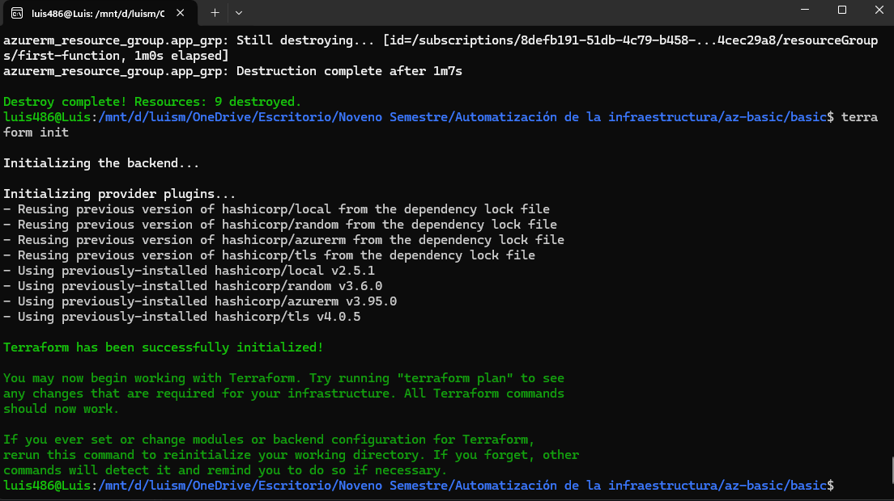
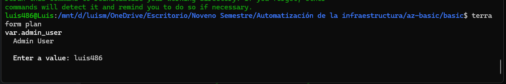
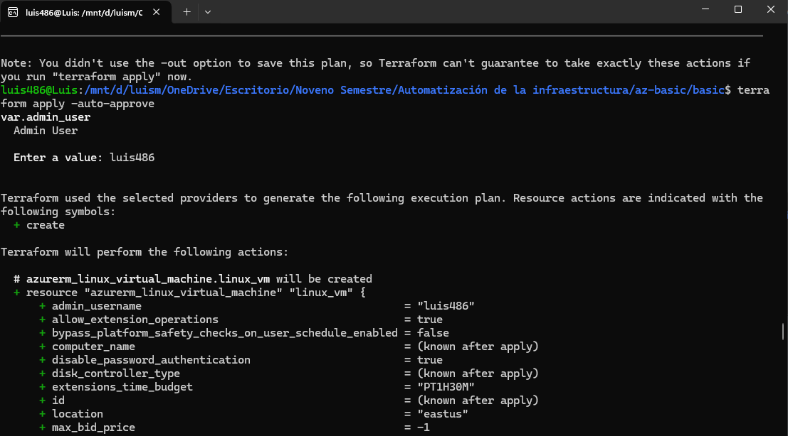
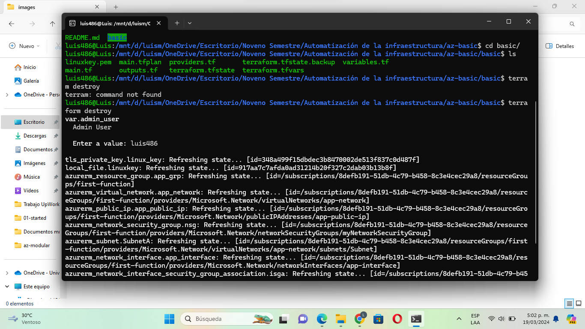
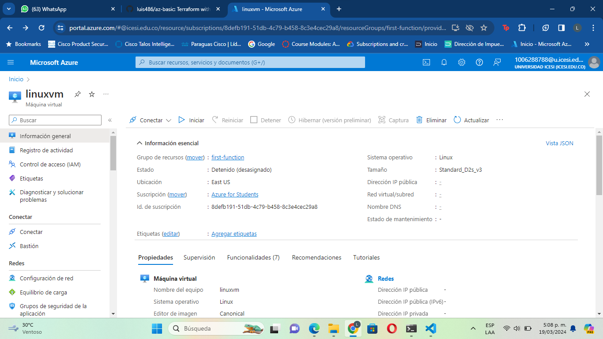
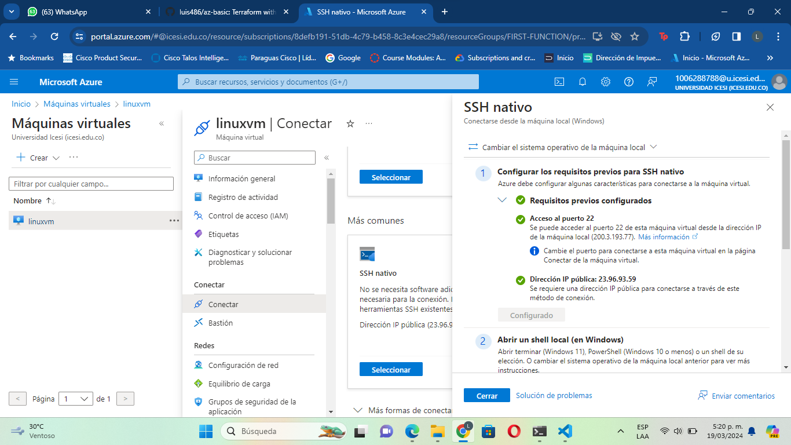

# Deploying a Virtual Machine in Azure with Terraform

This guide will walk you through the steps to deploy a virtual machine (VM) in Azure using Terraform.

## Prerequisites

Before you begin, make sure you have the following prerequisites installed on your machine:

- Terraform: You can download and install Terraform from the [official website](https://www.terraform.io/downloads.html).
- Azure CLI: Install Azure CLI by following the instructions [here](https://docs.microsoft.com/en-us/cli/azure/install-azure-cli).

## Steps

1. **Clone the Repository**: Clone the repository containing your Terraform configuration files.

    git clone https://github.com/luis486/az-basic

2. **Authenticate with Azure**: Log in to your Azure account using Azure CLI.

    az login

3. **Navigate to the Directory**: Change your current directory to the one containing the Terraform configuration files.

    cd basic

4. **Initialize Terraform**: Run the following command to initialize Terraform and download the required providers.

    terraform init

5. **Review and Customize Configuration**: Open the `main.tf` file in a text editor and review the configuration. Customize the settings as needed, such as VM size, region, username, password, etc.

6. **Plan the Deployment**: Run the following command to create an execution plan. This step will show you what Terraform will do when you apply the configuration.

    terraform plan

7. **Ensure the correct format**: If you make changes, ensure that have correct identantion

    terraform fmt
   
8. **Deploy the Virtual Machine**: If the plan looks good, apply the configuration to deploy the virtual machine.

    terraform apply

9. **Access the Virtual Machine**: Once the deployment is complete, you can access your virtual machine using the provided public IP address and credentials.

10. **Cleanup Resources**: When you no longer need the virtual machine, you can destroy it and clean up the resources by running:

    terraform destroy

## EVIDENCIAS

**Terraform Init**

**Terraform Plan**

**Terraform Apply**

**Terraform Apply**

**Visualización en Azure**

**SSH**

## Additional Resources

- [Terraform Documentation](https://www.terraform.io/docs/index.html)
- [Azure Provider Documentation](https://registry.terraform.io/providers/hashicorp/azurerm/latest/docs)
